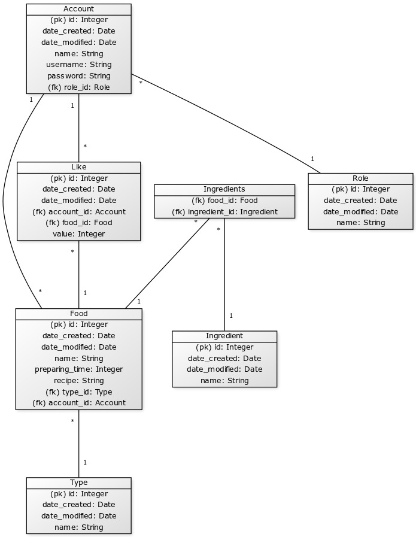

# Tietokanta

- Tässä on joitakin käyttötapauksia. Ohjelma on kuitenkin paljon laajempi, kuin mitä näistä selviää.

## Tietokannan normalisointi

- Tietokanta on pääosin normaalimuodossa. Ainoa, mikä ei ole, on ruokien kesto. Tämä on jätetty normalisoimatta, koska tämä on jokaiselle ruoalle omansa ja jokaisella ruoalla on vain yksi kesto. Kesto myös tarvitsee näyttää jokaisella sivulla jolla ruokakin on, joten tämä vähentää tarvetta sql-kyselyille. Vaikka ruokien kestossa esiintyykin toistoa tällä hetkellä, koin että denormalisointi on tässä kohtaa hyödyllisempää.

## Tietokantakaavio

http://yuml.me/edit/abf1f85e

## Create Table -lauseet

`CREATE TABLE role (
        id INTEGER NOT NULL, 
        date_created DATETIME, 
        date_modified DATETIME, 
        name VARCHAR(144) NOT NULL, 
        PRIMARY KEY (id)
);`

`CREATE TABLE ingredient (
        id INTEGER NOT NULL, 
        date_created DATETIME, 
        date_modified DATETIME, 
        name VARCHAR(20) NOT NULL, 
        PRIMARY KEY (id)
);`

`CREATE TABLE type (
        id INTEGER NOT NULL, 
        date_created DATETIME, 
        date_modified DATETIME, 
        name VARCHAR(20) NOT NULL, 
        PRIMARY KEY (id)
);`

`CREATE TABLE account (
        id INTEGER NOT NULL, 
        date_created DATETIME, 
        date_modified DATETIME, 
        name VARCHAR(144) NOT NULL, 
        username VARCHAR(144) NOT NULL, 
        password VARCHAR(144) NOT NULL, 
        role_id INTEGER, 
        PRIMARY KEY (id), 
        FOREIGN KEY(role_id) REFERENCES role (id)
);`

`CREATE TABLE ingredients (
        food_id INTEGER NOT NULL, 
        ingredient_id INTEGER NOT NULL, 
        PRIMARY KEY (food_id, ingredient_id), 
        FOREIGN KEY(food_id) REFERENCES food (id), 
        FOREIGN KEY(ingredient_id) REFERENCES ingredient (id)
);`

`CREATE TABLE IF NOT EXISTS "like" (
        id INTEGER NOT NULL, 
        date_created DATETIME, 
        date_modified DATETIME, 
        account_id INTEGER NOT NULL, 
        food_id INTEGER NOT NULL, 
        value INTEGER NOT NULL, 
        PRIMARY KEY (id), 
        FOREIGN KEY(account_id) REFERENCES account (id), 
        FOREIGN KEY(food_id) REFERENCES food (id)
);`

`CREATE TABLE food (
        id INTEGER NOT NULL, 
        date_created DATETIME, 
        date_modified DATETIME, 
        name VARCHAR(144) NOT NULL, 
        preparing_time INTEGER NOT NULL, 
        recipe VARCHAR(5000) NOT NULL, 
        type_id INTEGER NOT NULL, 
        account_id INTEGER NOT NULL, 
        PRIMARY KEY (id), 
        FOREIGN KEY(type_id) REFERENCES type (id), 
        FOREIGN KEY(account_id) REFERENCES account (id)
);`
